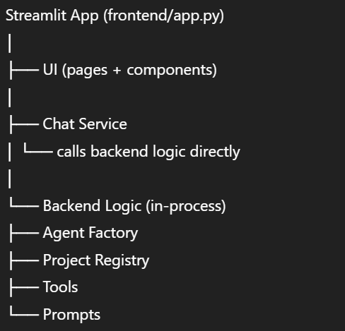
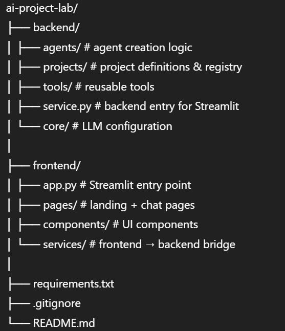

# 🧪 AI Project Lab (Agentic MVP)

A **learning-focused, modular AI agent platform** built with **Streamlit + LangChain + Gemini**, designed to help developers understand **how agent systems actually work** — without unnecessary complexity.

This project intentionally starts as a **true MVP** and is structured to scale as you add more AI projects.

---

## ✨ What This Project Is

- A **single Streamlit app** hosting multiple AI “projects”
- Each project is:
  - tool-driven
  - prompt-controlled
  - dynamically registered
- Uses **Gemini (Google Generative AI)** as the LLM
- Hosted on **Streamlit Cloud**

No databases.  
No auth.  
No memory (yet).

👉 **Pure agent fundamentals.**

---

## 🎯 Why This Project Exists

Most tutorials:
- mix frontend + backend concepts too early
- introduce memory, context, users before basics
- hide architecture decisions

This project does the opposite.

> **Goal:**  
> Help learners clearly understand:
> - what an agent is  
> - how tools are used  
> - how prompts control behavior  
> - how projects can scale cleanly  

---

## 🧠 Core Concepts Demonstrated

- ✅ Agent factory pattern
- ✅ Tool-based reasoning
- ✅ Structured outputs
- ✅ Project registry (scalable design)
- ✅ Clean separation of concerns
- ✅ Streamlit-friendly architecture

---

## 🏗️ Architecture Overview




⚠️ There is **no running backend server** on Streamlit Cloud.  
Backend logic is reused **as Python functions**, not via HTTP.

---

## 📂 Project Structure




---

## 🧪 Current Project: Weather Agent

### What it does
- Detects user city using IP lookup
- Fetches real-time weather data
- Responds with a friendly, structured answer

### Tools used
- `get_user_location`
- `get_weather_for_location`

### Response format
```json
{
  "punny_response": "🌤️ Looks like the weather is in a good mood!",
  "weather_conditions": "Current temperature in Delhi is 32°C with wind speed 8 km/h."
}
```


## Installation & Setup

### 1. Clone the Repository

```bash
https://github.com/Raunak-Kesharwani/genAi-workflow.git
```
```bash
cd genAi-workflow
```

### 2. Create a Virtual Environment

```bash
python -m venv venv
```

### 3. Activate the Virtual Environment

For **Windows**:
```bash
.\venv\Scripts\activate
```

For **Mac/Linux**:
```bash
source venv/bin/activate
```

### 4. Install Dependencies

```bash
pip install -r requirement.txt
```

### 5. Run the App

```bash
streamlit run frontend/app.py
```

## 🔐 Streamlit Cloud (Production)

Add your Gemini API key in **Streamlit Cloud → App Settings → Secrets**:

```toml
GEMINI_API_KEY = "your_api_key_here"
```

## Environment Configuration

- The app automatically reads required values from **environment variables**.

---

## ☁️ Hosting (Streamlit Cloud)

### Main File Path
```toml
frontend/app.py
```

## ➕ Adding a New Project (Future-Proof Design)

To add another AI project:

### 1️⃣ Create a New Project File
Create a new project file inside:
```toml 
backend/projects/
```


### 2️⃣ Define the Following
Inside the project file, define:
- **tools**
- **system prompt**
- **response schema**

### 3️⃣ Register the Project
Register the project in:
```toml 
backend/projects/registry.py
```


---

🎉 **That’s it!**  
No frontend changes required.
